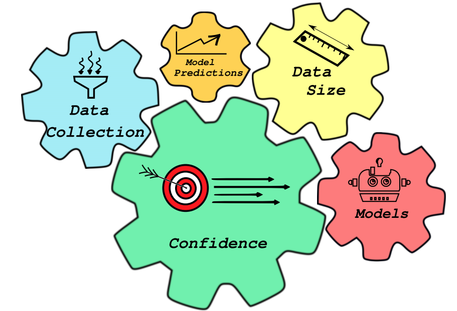

# Assigning Confidence to Molecular Property Prediction

### Background
This repository contains the citations for the paper: [Assigning Confidence to Molecular Property Prediction](https://arxiv.org/pdf/2102.11439.pdf). With an ever-growing field, we hope that these references provide a good starting point. We encourage readers to contribute to this list!

### Format
Within each category, papers are listed. Where possible, a link to the paper is provided. Please feel free to add additional references via pull requests! 

### Questions, problems?
Make a github issue 😄. Please be as clear and descriptive as possible. Please feel free to reach out in person: (akshat[DOT]nigam[AT]mail[DOT]utoronto[DOT]ca)

### Categories

[Reviews and Books](#reviews-and-books)  
[Datasets and Induced Bias Discussion](#datasets-and-induced-bias-discussion)  
[Uncertainty in Outputs](#uncertainty-in-outputs)  
[Uncertainty in the Input Features](#uncertainty-in-the-input-features)  
[Binding Affinities](#binding-affinities)  
[Generative Models](#generative-models)  

### Reviews and Books

**Deep Learning.**  
Ian Goodfellow, Yoshua Bengio, Aaron Courville.  
*MIT Press, November 2016.*  
[[Book](https://www.deeplearningbook.org/)]

**QSAR without borders.**  
Eugene N. Muratov, Jurgen Bajorath, Robert P. Sheridan, Igor V. Tetko, Dmitry Filimonov, Vladimir Poroikov, Tudor I. Oprea, Igor I. Baskin, Alexandre Varnek, Adrian Roitberg, Olexandr Isayev, Stefano Curtalolo, Denis Fourches, Yoram Cohen, Alan Aspuru-Guzik, David A. Winkler, Dimitris Agrafiotis, Artem Cherkasov, Alexander Tropsha.\
*Chemical Society Reviews, May 2020.*  
[[https://doi.org/10.1039/D0CS00098A](https://doi.org/10.1039/D0CS00098A)]

**A survey on transfer learning.**  
Sinno Jialin Pan, Qiang Yang.\
*IEEE, October 2009.*  
[[https://ieeexplore.ieee.org/abstract/document/5288526](https://ieeexplore.ieee.org/abstract/document/5288526)]

**Transfer Learning for Drug Discovery.**  
Chenjing CaiChenjing Cai, Shiwei Wang, Youjun Xu, Weilin Zhang, Ke Tang, Qi Ouyang, Luhua Lai, Jianfeng Pei.\
*Journal of Medicinal Chemistry, July 2020.*  
[[https://doi.org/10.1021/acs.jmedchem.9b02147](https://doi.org/10.1021/acs.jmedchem.9b02147)]

**Artificial Intelligence in Drug Discovery.**  
Nathan Brown.\
*Royal Society of Chemistry, Nov 2020.*  
[[https://pubs.rsc.org/en/content/ebook/978-1-78801-547-9](https://pubs.rsc.org/en/content/ebook/978-1-78801-547-9)]

**Deep Learning for the Life Sciences.**  
Bharath Ramsundar, Peter Eastman, Patrick Walters, Vijay Pande.\
*O'Reilly Media, Apr 2019.*  
[[https://www.oreilly.com/library/view/deep-learning-for/9781492039822/](https://www.oreilly.com/library/view/deep-learning-for/9781492039822/)]

**Aleatoric and Epistemic Uncertainty in Machine Learning: An Introduction to Concepts and Methods.**  
Eyke Hullermeier, Willem Waegeman\
*Preprint, Sept 2020.*  
[[https://arxiv.org/abs/1910.09457](https://arxiv.org/abs/1910.09457)]

**Random Forests.**  
Leo Breiman.\
*Machine Learning, Oct 2001.*  
[[https://doi.org/10.1023/A:1010933404324](https://doi.org/10.1023/A:1010933404324)]

**Gaussian Processes for Machine Learning.**  
Carl Edward Rasmussen, Christopher K. I. Williams.\
*MIT Press, Feb 2003.*  
[[https://mitpress.mit.edu/books/gaussian-processes-machine-learning](https://mitpress.mit.edu/books/gaussian-processes-machine-learning)]

**Active Learning.**  
Burr Settles.\
*Synthesis Lectures on Artificial Intelligence and Machine Learning, June 2012.*  
[[https://doi.org/10.2200/S00429ED1V01Y201207AIM018](https://doi.org/10.2200/S00429ED1V01Y201207AIM018)]

**Active-learning strategies in computer-assisted drug discovery.**  
Daniel Reker, Gisbert Schneider.\
*Drug Discovery Today, April 2015.*  
[[https://doi.org/10.1016/j.drudis.2014.12.004](https://doi.org/10.1016/j.drudis.2014.12.004)]

**Machine learning in computational docking.**  
Mohamed A.Khamis, Walid Gomaa, Walaa F. Ahmed.\
*CAAI, October 2016.*  
[[https://doi.org/10.1016/j.artmed.2015.02.002](https://doi.org/10.1016/j.artmed.2015.02.002)]

**Methodological uncertainties in drug-receptor binding free energy predictions based on classical molecular dynamics.**  
PieroProcacci.\
*Current Opinion in Structural Biology, April 2021.*  
[[https://doi.org/10.1016/j.sbi.2020.08.001](https://doi.org/10.1016/j.sbi.2020.08.001)]

**Binding Affinity via Docking: Fact and Fiction.**  
Tatu Pantsar, Antti Poso.\
*Molecules, July 2018.*  
[[https://doi.org/10.3390/molecules23081899](https://doi.org/10.3390/molecules23081899)]

**Chapter 4 Alchemical Free Energy Calculations: Ready for Prime Time?.**  
Michael R.Shirts, David L.Mobley, John D.Chodera.\
*Annual Reports in Computational Chemistry, 2007.*  
[[https://doi.org/10.1016/S1574-1400(07)03004-6](https://doi.org/10.1016/S1574-1400(07)03004-6)]

**An introduction to best practices in free energy calculations.**  
Michael R Shirts, David L Mobley.\
*Methods Mol Biol, 2013.*  
[[https://doi.org/10.1007/978-1-62703-017-5_11](https://doi.org/10.1007/978-1-62703-017-5_11)]

**Calculation of Binding Free Energies.**  
Vytautas Gapsys, Servaas Michielssens, Jan Henning Peters, Bert L de Groot, Hadas Leonov.\
*Methods Mol Biol, 2015.*  
[[https://doi.org/10.1007/978-1-4939-1465-4_9](https://doi.org/10.1007/978-1-4939-1465-4_9)]

**Rigorous Free Energy Simulations in Virtual Screening.**  
Zoe Cournia, Bryce K. Allen, Thijs Beuming, David A. Pearlman, Brian K. Radak, Woody Sherman.\
*J Chem Inf Model, June 2020.*  
[[https://doi.org/10.1021/acs.jcim.0c00116](https://doi.org/10.1021/acs.jcim.0c00116)]

**Accurate and Reliable Prediction of Relative Ligand Binding Potency in Prospective Drug Discovery by Way of a Modern Free-Energy Calculation Protocol and Force Field.**  
Wang et al.\
*Journal of the American Chemical Society, Jan 2015.*  
[[https://doi.org/10.1021/ja512751q](https://doi.org/10.1021/ja512751q)]

**Accurate calculation of the absolute free energy of binding for drug molecules.**  
Matteo Aldeghi, Alexander Heifetz, Michael J. Bodkin, Stefan Knappcd, Philip C. Biggin.\
*Chemical Science, May 2011.*  
[[https://doi.org/10.1039/C5SC02678D](https://doi.org/10.1039/C5SC02678D)]

**How Does a Drug Molecule Find Its Target Binding Site?.**  
Yibing Shan, Eric T. Kim, Michael P. Eastwood, Ron O. Dror, Markus A. Seeliger, David E. Shaw.\
*Journal of the American Chemical Society, Sept 2015.*  
[[https://doi.org/10.1021/ja202726y](https://doi.org/10.1021/ja202726y)]

**Inverse molecular design using machine learning: Generative models for matter engineering.**  
Benjamin Sanchez-Lengeling, Alán Aspuru-Guzik.\
*Science, July 2018.*  
[[https://doi.org/10.1126/science.aat2663](https://doi.org/10.1126/science.aat2663)]

**Data-Driven Strategies for Accelerated Materials Design.**  
Robert Pollice, Gabriel dos Passos Gomes, Matteo Aldeghi, Riley J. Hickman, Mario Krenn, Cyrille Lavigne, Michael Lindner-D’Addario, AkshatKumar Nigam, Cher Tian Ser, Zhenpeng Yao, Alán Aspuru-Guzik.\
*Accounts of Chemical Research, Feb 2021.*  
[https://doi.org/10.1021/acs.accounts.0c00785](https://doi.org/10.1021/acs.accounts.0c00785)]

### Datasets and Induced Bias Discussion: 

**Hidden bias in the DUD-E dataset leads to misleading performance of deep learning in structure-based virtual screening.**  
Lieyang Chen, Anthony Cruz, Steven Ramsey, Callum J. Dickson, Jose S. Duca, Viktor Hornak, David R. Koes, Tom Kurtzman.  
*PLOS ONE, August 2019.*  
[[https://doi.org/10.1371/journal.pone.0220113](https://doi.org/10.1371/journal.pone.0220113)]

**Directory of Useful Decoys, Enhanced (DUD-E): Better Ligands and Decoys for Better Benchmarking.**  
Michael M. Mysinger, Michael Carchia, John. J. Irwin, Brian K. Shoichet.  
*Journal of Medicinal Chemistry, June 2012.*  
[[https://doi.org/10.1021/jm300687e](https://doi.org/10.1021/jm300687e)]

**Dataset’s chemical diversity limits the generalizability of machine learning predictions.**  
Marta Glavatskikh, Jules Leguy, Gilles Hunault, Thomas Cauchy, Benoit Da Mota.  
*Journal of Cheminformatics, November 2019.*  
[[https://doi.org/10.1186/s13321-019-0391-2](https://doi.org/10.1186/s13321-019-0391-2)]

**Current status of methods for defining the applicability domain of (quantitative) structure-activity relationships: The report and recommendations of ecvam workshop 52.**  
Tatiana I Netzeva, Andrew Worth, Tom Aldenberg, Romualdo Benigni, Mark T D Cronin, Paolo Gramatica, Joanna S Jaworska, Scott Kahn, Gilles Klopman, Carol A Marchant, Glenn Myatt, Nina Nikolova-Jeliazkova, Grace Y Patlewicz, Roger Perkins, David Roberts, Terry Schultz, David W Stanton, Johannes J M van de Sandt, Weida Tong, Gilman Veith, Chihae Yang.  
*SAGE Publications, April 2005.*  
[[https://journals.sagepub.com/doi/10.1177/026119290503300209](https://journals.sagepub.com/doi/10.1177/026119290503300209)]

**Applicability domain for QSAR models: where theory meets reality.**  
Domenico Gadaleta, Giuseppe Felice Mangiatordi, Marco Catto, Angelo Carotti, Orazio Nicolotti.  
*IGI Global, Feb 2021.*  
[[https://dx.doi.org/10.4018/IJQSPR.2016010102](https://dx.doi.org/10.4018/IJQSPR.2016010102)]

**Inductive transfer learning for molecular activity prediction: Next-Gen QSAR Models with MolPMoFiT.**  
Xinhao Li, Denis Fourches.  
*Journal of Cheminformatics volume, April 2020.*  
[[https://doi.org/10.1186/s13321-020-00430-x](https://doi.org/10.1186/s13321-020-00430-x)]

**Using Rule-Based Labels for Weak Supervised Learning: A ChemNet for Transferable Chemical Property Prediction.**  
Garrett B. Goh, Charles Siegel, Abhinav Vishnu, Nathan O. Hodas.  
*Preprint, March 2018.*  
[[https://arxiv.org/abs/1712.02734](https://arxiv.org/abs/1712.02734)]

**ZINC20—A Free Ultralarge-Scale Chemical Database for Ligand Discovery.**  
John J. Irwin, Khanh G. Tang, Jennifer Young, Chinzorig Dandarchuluun, Benjamin R. Wong, Munkhzul Khurelbaatar, Yurii S. Moroz, John Mayfield, Roger A. Sayle.  
*Journal of Chemical Information and Modeling, October 2020.*
[[https://doi.org/10.1021/acs.jcim.0c00675](https://doi.org/10.1021/acs.jcim.0c00675)]

**Quantum chemistry structures and properties of 134 kilo molecules.**  
Raghunathan Ramakrishnan, Pavlo O. Dral, Matthias Rupp & O. Anatole von Lilienfeld.  
*Scientific Data, August 2014.*  
[[https://doi.org/10.1038/sdata.2014.22](https://doi.org/10.1038/sdata.2014.22)]

**PubChemQC PM6: Data Sets of 221 Million Molecules with Optimized Molecular Geometries and Electronic Properties.**  
Maho Nakata, Tomomi Shimazaki, Masatomo Hashimoto, Toshiyuki Maeda.  
*Journal of Cheminformatics volume, October 2020.*  
[[https://doi.org/10.1021/acs.jcim.0c00740](https://doi.org/10.1021/acs.jcim.0c00740)]

**Tox21 Data Browser.**  
[[DATA](https://tripod.nih.gov/tox21/)]

**ToxCast Database (invitroDB).**  
[[DATA](https://epa.figshare.com/articles/dataset/ToxCast_Database_invitroDB_/6062623)]

**SIDER Side Effect Resource.**  
[[DATA](http://sideeffects.embl.de/)]

**MoleculeNet: A Benchmark for Molecular Machine Learning.**  
Zhenqin Wu, Bharath Ramsundar, Evan N. Feinberg, Joseph Gomes, Caleb Geniesse, Aneesh S. Pappu, Karl Leswing, Vijay Pande.  
*Chemical Science, October 2017.*  
[[https://doi.org/10.1039/C7SC02664A](https://doi.org/10.1039/C7SC02664A)]

**ChEMBL: towards direct deposition of bioassay data.**  
David Mendez, Anna Gaulton, A Patrícia Bento, Jon Chambers, Marleen De Veij, Eloy Félix, María Paula Magariños, Juan F Mosquera, Prudence Mutowo, Michał Nowotka, María Gordillo-Marañón, Fiona Hunter, Laura Junco, Grace Mugumbate, Milagros Rodriguez-Lopez, Francis Atkinson, Nicolas Bosc, Chris J Radoux, Aldo Segura-Cabrera, Anne Hersey, Andrew R Leach.  
*Nucleic Acids Research, January 2019.*  
[[https://doi.org/10.1093/nar/gky1075](https://doi.org/10.1093/nar/gky1075)]

**AqSolDB, a curated reference set of aqueous solubility and 2D descriptors for a diverse set of compounds.**  
Murat Cihan Sorkun, Abhishek Khetan, Suleyman Er.  
*Scientific Data, August 2019.*  
[[https://doi.org/10.1038/s41597-019-0151-1](https://doi.org/10.1038/s41597-019-0151-1)]

**Olfactory perception of chemically diverse molecules.**  
Andreas Keller, Leslie B. Vosshall.  
*BMC Neurosci , August 2016.*  
[[https://doi.org/10.1186/s12868-016-0287-2](https://doi.org/10.1186/s12868-016-0287-2)]

**FreeSolv: a database of experimental and calculated hydration free energies, with input files.**  
David L Mobley, J Peter Guthrie.  
*J Comput Aided Mol Des , June 2014.*  
[[https://doi.org/10.1007/s10822-014-9747-x](https://doi.org/10.1007/s10822-014-9747-x)]

**ESOL:  Estimating Aqueous Solubility Directly from Molecular Structure.**  
John S. Delaney.  
*J. Chem. Inf. Comput. Sci, March 2004.*  
[[https://doi.org/10.1021/ci034243x](https://doi.org/10.1021/ci034243x)]

**In silico evaluation of logD7.4 and comparison with other prediction methods.**  
Jian‐Bing Wang, Dong‐Sheng Cao, Min‐Feng Zhu, Yong‐Huan Yun, Nan Xiao, Yi‐Zeng Liang.  
*Journal of Chemometrics, May 2015.*  
[[ https://doi.org/10.1002/cem.2718]( https://doi.org/10.1002/cem.2718)]

**Lipophilicity Dataset - logD7.4 of 1,130 Compounds (2017).**  
[[DATA](doi:10.6084/m9.figshare.5596750.)]

**PubChem's BioAssay Database.**  
Yanli Wang, Jewen Xiao, Tugba O. Suzek, Jian Zhang, Jiyao Wang, Zhigang Zhou, Lianyi Han, Karen Karapetyan, Svetlana Dracheva, Benjamin A. Shoemaker, Evan Bolton, Asta Gindulyte, Stephen H. Bryant.  
*Nucleic Acids Res, Jan 2012.*  
[[https://doi.org/10.1093/nar/gkr1132](https://doi.org/10.1093/nar/gkr1132)]

**The PDBbind Database:  Collection of Binding Affinities for Protein−Ligand Complexes with Known Three-Dimensional Structures.**  
Renxiao Wang, Xueliang Fang, Yipin Lu, Shaomeng Wang.  
*Journal of Medicinal Chemistry, May 2004.*  
[[https://doi.org/10.1021/jm030580l](https://doi.org/10.1021/jm030580l)]

**PDB-wide collection of binding data: current status of the PDBbind database.**  
Zhihai Liu, Yan Li, Li Han, Jie Li, Jie Liu, Zhixiong Zhao, Wei Nie, Yuchen Liu, Renxiao Wang.  
*Bioinformatics, Feb 2015.*  
[[https://doi.org/10.1093/bioinformatics/btu626](https://doi.org/10.1093/bioinformatics/btu626)]

**A Bayesian Approach to in Silico Blood-Brain Barrier Penetration Modeling.**  
Ines Filipa Martins, Ana L. Teixeira, Luis Pinheiro, Andre O. Falcao.  
*Journal of Chemical Information and Modeling, May 2012.*  
[[https://doi.org/10.1021/ci300124c](https://doi.org/10.1021/ci300124c)]

### Uncertainty in Outputs: 

**Three Useful Dimensions for Domain Applicability in QSAR Models Using Random Forest.**  
Robert P. Sheridan.  
*Journal of Chemical Information and Modeling, March 2012.*  
[[https://doi.org/10.1021/ci300004n](https://doi.org/10.1021/ci300004n)]

**Assessment of Machine Learning Reliability Methods for Quantifying the Applicability Domain of QSAR Regression Models.**  
Marko Toplak, Rok Mocnik, Matija Polajnar, Zoran Bosnic, Lars Carlsson, Catrin Hasselgren, Janez Demsar, Scott Boyer, Blaz Zupan, Jonna Stalring.  
*Journal of Chemical Information and Modeling, Feb 2014.*  
[[https://doi.org/10.1021/ci4006595](https://doi.org/10.1021/ci4006595)]

**Simple and Scalable Predictive Uncertainty Estimation using Deep Ensembles.**  
Balaji Lakshminarayanan, Alexander Pritzel, Charles Blundell.  
*Preprint, Nov 2017.*  
[[https://arxiv.org/abs/1612.01474](https://arxiv.org/abs/1612.01474)]

**Evaluating Scalable Uncertainty Estimation Methods for Deep Learning-Based Molecular Property Prediction.**  
Gabriele Scalia, Colin A. Grambow, Barbara Pernici, Yi-Pei Li, William H. Green.  
*Journal of Chemical Information and Modeling, April 2020.*  
[[https://doi.org/10.1021/acs.jcim.9b00975](https://doi.org/10.1021/acs.jcim.9b00975)]

**Estimating the mean and variance of the target probability distribution.**  
D.A. Nix, A.S. Weigend.  
*IEEE, Aug 2002.*  
[[https://ieeexplore.ieee.org/document/374138](https://ieeexplore.ieee.org/document/374138)]

**Modelling compound cytotoxicity using conformal prediction and PubChem HTS data.**  
Fredrik Svensson, Ulf Norinder, Andreas Bender.  
*Toxicology Research, Oct 2016.*  
[[https://doi.org/10.1039/C6TX00252H](https://doi.org/10.1039/C6TX00252H)]

**Introducing Conformal Prediction in Predictive Modeling. A Transparent and Flexible Alternative to Applicability Domain Determination.**  
Ulf Norinder, Lars Carlsson, Scott Boyer, Martin Eklund.  
*Journal of Chemical Information and Modeling, May 2014.*  
[[https://doi.org/10.1021/ci5001168](https://doi.org/10.1021/ci5001168)]

**Maximizing gain in high-throughput screening using conformal prediction.**  
Fredrik Svensson, Avid M. Afzal, Ulf Norinder, Andreas Bender.  
*Journal of Cheminformatics, Feb 2018.*  
[[https://doi.org/10.1186/s13321-018-0260-4](https://doi.org/10.1186/s13321-018-0260-4)]

**Concepts and Applications of Conformal Prediction in Computational Drug Discovery.**  
Fredrik Svensson, Avid M. Afzal, Ulf Norinder, Andreas Bender.  
*Preprint, Aug 2019.*  
[[https://arxiv.org/abs/1908.035](https://arxiv.org/abs/1908.035)]

**Machine learning in drug development: Characterizing the effect of 30 drugs on the QT interval using Gaussian process regression, sensitivity analysis, and uncertainty quantification.**  
Francisco Sahli Costabal, Kristen Matsuno, Jiang Yao, Paris Perdikaris, Ellen Kuhl.  
*Computer Methods in Applied Mechanics and Engineering, May 2019.*  
[[https://doi.org/10.1016/j.cma.2019.01.033](https://doi.org/10.1016/j.cma.2019.01.033)]

**SAMPL6 challenge results from pKa predictions based on a general Gaussian process model.**  
Caitlin C. Bannan, David L. Mobley, A. Geoffrey Skillman.  
*J Comput Aided Mol Des, Oct 2018.*  
[[https://doi.org/10.1007/s10822-018-0169-z](https://doi.org/10.1007/s10822-018-0169-z)]

**Leveraging Uncertainty in Machine Learning Accelerates Biological Discovery and Design.**  
Brian Hie, Bryan D. Bryson, Bonnie Berger.  
*Cell, Nov 2020.*  
[[https://doi.org/10.1016/j.cels.2020.09.007](https://doi.org/10.1016/j.cels.2020.09.007)]

**Weight Uncertainty in Neural Networks.**  
Charles Blundell, Julien Cornebise, Koray Kavukcuoglu, Daan Wierstra.  
*Preprint, May 2015.*  
[[https://arxiv.org/abs/1505.05424](https://arxiv.org/abs/1505.05424)]

**Bayesian semi-supervised learning for uncertainty-calibrated prediction of molecular properties and active learning.**  
Yao Zhang, Alpa A. Lee.  
*Chemical Science, July 2019.*  
[[https://doi.org/10.1039/C9SC00616H](https://doi.org/10.1039/C9SC00616H)]

**On Calibration of Modern Neural Networks.**  
Chuan Guo, Geoff Pleiss, Yu Sun, Kilian Q. Weinberger.  
*Preprint, Aug 2017.*  
[[https://arxiv.org/abs/1706.04599](https://arxiv.org/abs/1706.04599)]

**Predicting Drug-Induced Liver Injury with Bayesian Machine Learning.**  
Dominic P. Williams, Stanley E. Lazic, Alison J. Foster, Elizaveta Semenova, Paul Morgan.  
*Chem. Res. Toxicol., Sept 2019.*  
[[https://doi.org/10.1021/acs.chemrestox.9b00264](https://doi.org/10.1021/acs.chemrestox.9b00264)]

**A Bayesian neural network for toxicity prediction.**  
ElizavetaSemenova, Dominic P.Williams, Avid M. Afzal, Stanley E. Lazicc.  
*Computational Toxicology, Nov 2020.*  
[[https://doi.org/10.1016/j.comtox.2020.100133](https://doi.org/10.1016/j.comtox.2020.100133)]

**Predicting Drug Safety and Communicating Risk: Benefits of a Bayesian Approach.**  
Stanley E Lazic, Nicholas Edmunds, Christopher E Pollard.  
*Toxicological Sciences, Nov 2017.*  
[[https://doi.org/10.1093/toxsci/kfx236](https://doi.org/10.1093/toxsci/kfx236)]

**Active learning for computational chemogenomics.**  
Daniel Reker, Petra Schneider, Gisbert Schneider, JB Brown.  
*Future Medicinal Chemistry, March 2017.*  
[[https://doi.org/10.4155/fmc-2016-0197](https://doi.org/10.4155/fmc-2016-0197)]

**A Bayesian graph convolutional network for reliable prediction of molecular properties with uncertainty quantification.**  
Seongok Ryu, Yongchan Kwon, Woo Youn Kim.  
*Chemical Science, July 2019.*  
[[https://doi.org/10.1039/C9SC01992H](https://doi.org/10.1039/C9SC01992H)]

**Uncertainty Quantification Using Neural Networks for Molecular Property Prediction.**  
Lior Hirschfeld, Kyle Swanson, Kevin Yang, Regina Barzilay, Connor W. Coley.  
*Journal of Chemical Information and Modeling, July 2020.*  
[[https://doi.org/10.1021/acs.jcim.0c00502](https://doi.org/10.1021/acs.jcim.0c00502)]

**Gaussian Process Molecule Property Prediction with FlowMO.**  
Henry B. Moss, Ryan-Rhys Griffiths.  
*Preprint, Oct 2020.*  
[[https://arxiv.org/abs/2010.01118](https://arxiv.org/abs/2010.01118)]

### Uncertainty in the Input Features

**Frog2: Efficient 3D conformation ensemble generator for small compounds.**  
Maria A Miteva, Frederic Guyon, Pierre Tuffery.  
*Nucleic Acids Research, July 2010.*  
[[https://doi.org/10.1093/nar/gkq325](https://doi.org/10.1093/nar/gkq325)]

**Tautomerism of Warfarin: Combined Chemoinformatics, Quantum Chemical, and NMR Investigation.**  
Laura Guasch, Megan L. Peach, Marc C. Nicklaus.  
*Journal of Organic Chemistry, Sept 2015.*  
[[https://doi.org/10.1021/acs.joc.5b01370](https://doi.org/10.1021/acs.joc.5b01370)]

**Bayesian Kernel Regression for Noisy Inputs Based on Nadaraya–Watson Estimator Constructed from Noiseless Training Data.**  
Ryo Hanafusa, Takeshi Okadome.  
*Advances in Data Science and Adaptive Analysis, July 2002.*  
[[https://doi.org/10.1142/S2424922X20500047](https://doi.org/10.1142/S2424922X20500047)]

**Bayesian Gaussian Process Latent Variable Model.**  
Michalis Titsias, Neil D. Lawrence.  
*International Conference on Artificial Intelligence and Statistics, 2010.*  
[[http://proceedings.mlr.press/v9/titsias10a.html](http://proceedings.mlr.press/v9/titsias10a.html)]

**Molecular machine learning with conformer ensembles.**  
Simon Axelrod, Rafael Gomez-Bombarelli.  
*Preprint, Dec 2010.*  
[[https://arxiv.org/abs/2012.08452](https://arxiv.org/abs/2012.08452)]

### Binding Affinities

**AutoDock Vina: Improving the speed and accuracy of docking with a new scoring function, efficient optimization, and multithreading.**  
Oleg Trott, Arthur J. Olson.  
*J Comput Chem, Jan 2010.*  
[[https://doi.org/10.1002/jcc.21334](https://doi.org/10.1002/jcc.21334)]

**Glide:  A New Approach for Rapid, Accurate Docking and Scoring. 1. Method and Assessment of Docking Accuracy.**  
Richard A. Friesner, Jay L. Banks, Robert B. Murphy, Thomas A. Halgren, Jasna J. Klicic, Daniel T. Mainz, Matthew P. Repasky, Eric H. Knoll, Mee Shelley, Jason K. Perry, David E. Shaw, Perry Francis, Peter S. Shenkin.  
*Journal of Medicinal Chemistry, Feb 2004.*  
[[https://doi.org/10.1021/jm0306430](https://doi.org/10.1021/jm0306430)]

**Surflex-Dock: Docking benchmarks and real-world application.**  
Russell Spitzer, Ajay N Jain.  
*J Comput Aided Mol Des, June 2012.*  
[[https://doi.org/10.1007/s10822-011-9533-y](https://doi.org/10.1007/s10822-011-9533-y)]

**Improved protein-ligand docking using GOLD.**  
Marcel L Verdonk, Jason C Cole, Michael J Hartshorn, Christopher W Murray, Richard D Taylor.  
*Proteins, Sept 2003.*  
[[https://doi.org/10.1002/prot.10465](https://doi.org/10.1002/prot.10465)]

**Comparative assessment of scoring functions on a diverse test set.**  
Tiejun Cheng, Xun Li, Yan Li, Zhihai Liu, Renxiao Wang.  
*J Chem Inf Model, April 2009.*  
[[https://doi.org/10.1021/ci9000053](https://doi.org/10.1021/ci9000053)]

**Comparative Assessment of Scoring Functions on an Updated Benchmark: 2. Evaluation Methods and General Results.**  
Yan Li, Li Han, Zhihai Liu, Renxiao Wang.  
*J Chem Inf Model, April 2014.*  
[[https://doi.org/10.1021/ci500081m](https://doi.org/10.1021/ci500081m)]

**KDEEP: Protein–Ligand Absolute Binding Affinity Prediction via 3D-Convolutional Neural Networks.**  
José Jiménez, Miha Škalič, Gerard Martínez-Rosell, Gianni De Fabritiis.  
*J Chem Inf Model, Jan 2018.*  
[[https://doi.org/10.1021/acs.jcim.7b00650](https://doi.org/10.1021/acs.jcim.7b00650)]

**Combining Docking Pose Rank and Structure with Deep Learning Improves Protein–Ligand Binding Mode Prediction over a Baseline Docking Approach.**  
Joseph A. Morrone*, Jeffrey K. Weber, Tien Huynh, Heng Luo, and Wendy D. Cornell.  
*J Chem Inf Model, Feb 2020.*  
[[https://doi.org/10.1021/acs.jcim.9b00927](https://doi.org/10.1021/acs.jcim.9b00927)]

**High‐Temperature Equation of State by a Perturbation Method. I. Nonpolar Gases.**  
Robert W. Zwanzig.  
*J. Chem. Phys, 1954.*  
[[https://doi.org/10.1063/1.1740409](https://doi.org/10.1063/1.1740409)]

**Statistical Mechanics of Fluid Mixtures.**  
Robert W. Zwanzig.  
*J. Chem. Phys, 1935.*  
[[https://doi.org/10.1063/1.1749657](https://doi.org/10.1063/1.1749657)]

**THE weighted histogram analysis method for free‐energy calculations on biomolecules. I. The method.**  
Shankar Kumar  John M. Rosenberg  Djamal Bouzida  Robert H. Swendsen  Peter A. Kollman.  
*J. Comp. Chem., Oct 1992.*  
[[https://doi.org/10.1002/jcc.540130812](https://doi.org/10.1002/jcc.540130812)]

**Efficient estimation of free energy differences from Monte Carlo data.**  
Charles HBennett.  
*Journal of Computational Physics, Oct 1976.*  
[[https://doi.org/10.1016/0021-9991(76)90078-4](https://doi.org/10.1016/0021-9991(76)90078-4)]

**Statistically optimal analysis of samples from multiple equilibrium states.**  
Charles HBennett.  
*J. Chem. Phys, Sept 2008.*  
[[https://doi.org/10.1063/1.2978177](https://doi.org/10.1063/1.2978177)]

**Multiensemble Markov models of molecular thermodynamics and kinetics.**  
Hao Wu, Fabian Paul, Christoph Wehmeyer, Frank Noé.  
*PNAS, April 2016.*  
[[https://doi.org/10.1073/pnas.1525092113](https://doi.org/10.1073/pnas.1525092113)]

**Free Energies from Dynamic Weighted Histogram Analysis Using Unbiased Markov State Model.**  
Edina Rosta, Gerhard Hummer.  
*Journal of Chemical Theory and Computation, Dec 2014.*  
[[https://doi.org/10.1021/ct500719p](https://doi.org/10.1021/ct500719p)]

**Best Practices for Quantification of Uncertainty and Sampling Quality in Molecular Simulations [Article v1.0].**  
Alan Grossfield, Paul N Patrone, Daniel R Roe, Andrew J Schultz, Daniel W Siderius, Daniel M Zuckerman.  
*JLiving J Comput Mol Sci, Oct 2018.*  
[[https://doi.org/10.33011/livecoms.1.1.5067](https://doi.org/10.33011/livecoms.1.1.5067)]

**A Simple Method for Automated Equilibration Detection in Molecular Simulations.**  
John D. Chodera.  
*Journal of Chemical Theory and Computation, Jan 2016.*  
[[https://doi.org/10.1021/acs.jctc.5b00784](https://doi.org/10.1021/acs.jctc.5b00784)]

**Entropy production fluctuation theorem and the nonequilibrium work relation for free energy differences.**  
Gavin E. Crooks.  
*Physical Review E, Sept 1999.*  
[[https://doi.org/10.1103/PhysRevE.60.2721](https://doi.org/10.1103/PhysRevE.60.2721)]

**Large scale relative protein ligand binding affinities using non-equilibrium alchemy.**  
Vytautas Gapsys, Laura Pérez-Benito, Matteo Aldeghi, Daniel Seeliger, Herman van Vlijmen, Gary Tresadern, Bert L. de Groot.  
*Chemical Science, Dec 2019.*  
[[https://doi.org/10.1039/C9SC03754C](https://doi.org/10.1039/C9SC03754C)]

**Challenges Encountered Applying Equilibrium and Non-Equilibrium Binding Free Energy Calculations.**  
Hannah Baumann, Vytautas Gapsys, Bert L. de Groot, David Mobley.  
*Preprint, Nov 2020.*  
[[https://doi.org/10.26434/chemrxiv.13225181.v1](https://doi.org/10.26434/chemrxiv.13225181.v1)]

**Non-equilibrium approach for binding free energies in cyclodextrins in SAMPL7: force fields and software.**  
Yuriy Khalak, Gary Tresadern, Bert L. de Groot, Vytautas Gapsys.  
*Journal of Computer-Aided Molecular Design , Nov 2020.*  
[[https://doi.org/10.1007/s10822-020-00359-1](https://doi.org/10.1007/s10822-020-00359-1)]

**On the importance of statistics in molecular simulations for thermodynamics, kinetics and simulation box size.**  
Vytautas Gapsys, Bert L de Groot.  
*eLife, Aug 2020.*  
[[https://doi.org/10.7554/eLife.57589](https://doi.org/10.7554/eLife.57589)]

**Lessons learned from comparing molecular dynamics engines on the SAMPL5 dataset.**  
Michael R. Shirts, Christoph Klein, Jason M. Swails, Jian Yin, Michael K. Gilson, David L. Mobley, David A. Case, Ellen D. Zhong.  
*Journal of Computer-Aided Molecular Design, Oct 2016.*  
[[https://doi.org/10.1007/s10822-016-9977-1](https://doi.org/10.1007/s10822-016-9977-1)]

**Testing for physical validity in molecular simulations.**  
Pascal T. Merz,Michael R. Shirts.  
*PLOS ONE, Oct 2016.*  
[[https://doi.org/10.1371/journal.pone.0202764](https://doi.org/10.1371/journal.pone.0202764)]

**New developments in force fields for biomolecular simulations.**  
Paul S Nerenberg , Teresa Head-Gordon.  
*Curr Opin Struct Biol, April 2018.*  
[[https://doi.org/10.1016/j.sbi.2018.02.002](https://doi.org/10.1016/j.sbi.2018.02.002)]

**Are Protein Force Fields Getting Better? A Systematic Benchmark on 524 Diverse NMR Measurements.**  
Kyle A Beauchamp, Yu-Shan Lin, Rhiju Das, Vijay S Pande.  
*J Chem Theory Comput., Oct 2018.*  
[[https://doi.org/10.1021/ct2007814](https://doi.org/10.1021/ct2007814)]

**Escaping Atom Types in Force Fields Using Direct Chemical Perception.**  
David L. Mobley, Caitlin C. Bannan, Andrea Rizzi, Christopher I. Bayly, John D. Chodera, Victoria T. Lim, Nathan M. Lim, Kyle A. Beauchamp, David R. Slochower, Michael R. Shirts, Michael K. Gilson, Peter K. Eastman.  
*Journal of Chemical Theory and Computation, April 2012.*  
[[https://doi.org/10.1021/acs.jctc.8b00640](https://doi.org/10.1021/acs.jctc.8b00640)]

**Building Force Fields: An Automatic, Systematic, and Reproducible Approach.**  
Lee-Ping Wang, Todd J. Martinez, Vijay S. Pande.  
*The Journal of Physical Chemistry Letters, May 2014.*  
[[https://doi.org/10.1021/jz500737m](https://doi.org/10.1021/jz500737m)]

**Building a More Predictive Protein Force Field: A Systematic and Reproducible Route to AMBER-FB15.**  
Lee-Ping Wang†Orcid, Keri A. McKiernan, Joseph Gomes, Kyle A. Beauchamp, Teresa Head-Gordon, Julia E. Rice, William C. Swope, Todd J. Martínez, Vijay S. Pande.  
*The Journal of Physical Chemistry B, March 2017.*  
[[https://doi.org/10.1021/acs.jpcb.7b02320](https://doi.org/10.1021/acs.jpcb.7b02320)]

**Systematic Optimization of Water Models Using Liquid/Vapor Surface Tension Data.**  
Yudong Qiu, Paul S. Nerenberg, Teresa Head-Gordon, Lee-Ping Wang.  
*The Journal of Physical Chemistry B, July 2019.*  
[[https://doi.org/10.1021/acs.jpcb.9b05455](https://doi.org/10.1021/acs.jpcb.9b05455)]

**Current Status of the AMOEBA Polarizable Force Field.**  
Ponder et al.  
*J. Phys. Chem. B, Feb 2010.*  
[[https://doi.org/10.1021/jp910674d](https://doi.org/10.1021/jp910674d)]

**AMOEBA binding free energies for the SAMPL7 TrimerTrip host–guest challenge.**  
Yuanjun Shi, Marie L. Laury, Zhi Wang, Jay W. Ponder.  
*Journal of Computer-Aided Molecular Design, Nov 2020.*  
[[https://doi.org/10.1007/s10822-020-00358-2](https://doi.org/10.1007/s10822-020-00358-2)]

**ANI-1: an extensible neural network potential with DFT accuracy at force field computational cost.**  
J. S. Smith, O. Isayev, A. E. Roitberg.  
*Chemical Science, Feb 2017.*  
[[https://doi.org/10.1039/C6SC05720A](https://doi.org/10.1039/C6SC05720A)]

**Simulating protein–ligand binding with neural network potentials.**  
Shae-Lynn J. Lahey, Christopher N. Rowley.  
*Chemical Science, Jan 2020.*  
[[https://doi.org/10.1039/C9SC06017K](https://doi.org/10.1039/C9SC06017K)]

**Assessing the accuracy of octanol–water partition coefficient predictions in the SAMPL6 Part II log P Challenge.**  
Mehtap Işık, Teresa Danielle Bergazin, Thomas Fox, Andrea Rizzi, John D. Chodera, David L. Mobley.  
*Journal of Computer-Aided Molecular Design, Feb 2020.*  
[[https://doi.org/10.1007/s10822-020-00295-0](https://doi.org/10.1007/s10822-020-00295-0)]

### Generative Models

**Auto-Encoding Variational Bayes.**  
Diederik P Kingma, Max Welling.  
*Preprint, May 2014.*  
[https://arxiv.org/abs/1312.6114](https://arxiv.org/abs/1312.6114)]

**Generative Adversarial Networks.**  
Ian J. Goodfellow, Jean Pouget-Abadie, Mehdi Mirza, Bing Xu, David Warde-Farley, Sherjil Ozair, Aaron Courville, Yoshua Bengio.  
*Preprint, June 2014.*  
[[https://arxiv.org/abs/1406.2661](https://arxiv.org/abs/1406.2661)]

**Reinforcement Learning: An Introduction.**  
Richard S. Sutton, Andrew G. Barto.  
*MIT Press, 2018.*  
[[http://incompleteideas.net/book/the-book.html](http://incompleteideas.net/book/the-book.html)]

**An Introduction to Genetic Algorithms.**  
Melanie Mitchell.  
*MIT Press, 1998.*  
[[https://mitpress.mit.edu/books/introduction-genetic-algorithms](https://mitpress.mit.edu/books/introduction-genetic-algorithms)]

**Automatic Chemical Design Using a Data-Driven Continuous Representation of Molecules.**  
Rafael Gómez-Bombarelli, Jennifer N. Wei, David Duvenaud, José Miguel Hernández-Lobato, Benjamín Sánchez-Lengeling, Dennis Sheberla, Jorge Aguilera-Iparraguirre, Timothy D. Hirzel, Ryan P. Adams, Alán Aspuru-Guzik.  
*ACS Central Science, Jan 2018.*  
[[https://doi.org/10.1021/acscentsci.7b00572](https://doi.org/10.1021/acscentsci.7b00572)]

**Objective-Reinforced Generative Adversarial Networks (ORGAN) for Sequence Generation Models.**  
Gabriel Lima Guimaraes, Benjamin Sanchez-Lengeling, Carlos Outeiral, Pedro Luis Cunha Farias, Alán Aspuru-Guzik.  
*Preprint, Feb 2018.*  
[[https://arxiv.org/abs/1705.10843](https://arxiv.org/abs/1705.10843)]

**Optimizing distributions over molecular space. An Objective-Reinforced Generative Adversarial Network for Inverse-design Chemistry (ORGANIC).**  
Benjamin Sanchez-Lengeling, Carlos Outeiral, Gabriel L. Guimaraes, Alan Aspuru-Guzik.  
*Preprint, Aug 2017.*  
[[https://doi.org/10.26434/chemrxiv.5309668.v3](https://doi.org/10.26434/chemrxiv.5309668.v3)]

**Self-referencing embedded strings (SELFIES): A 100% robust molecular string representation.**  
Mario Krenn, Florian Häse, AkshatKumar Nigam, Pascal Friederich, Alan Aspuru-Guzik.  
*MLST, Oct 2020.*  
[[https://iopscience.iop.org/article/10.1088/2632-2153/aba947](https://iopscience.iop.org/article/10.1088/2632-2153/aba947)]

**Beyond Generative Models: Superfast Traversal, Optimization, Novelty, Exploration and Discovery (STONED) Algorithm for Molecules using SELFIES.**  
AkshatKumar Nigam, Robert Pollice, Mario Krenn, Gabriel dos Passos Gomes, Alan Aspuru-Guzik.  
*Preprint, Jan 2021.*  
[[https://doi.org/10.26434/chemrxiv.13383266.v2](https://doi.org/10.26434/chemrxiv.13383266.v2)]

**Deep Molecular Dreaming: Inverse machine learning for de-novo molecular design and interpretability with surjective representations.**  
Cynthia Shen, Mario Krenn, Sagi Eppel, Alan Aspuru-Guzik.  
*Preprint, Dec 2020.*  
[[https://arxiv.org/abs/2012.09712](https://arxiv.org/abs/2012.09712)]

